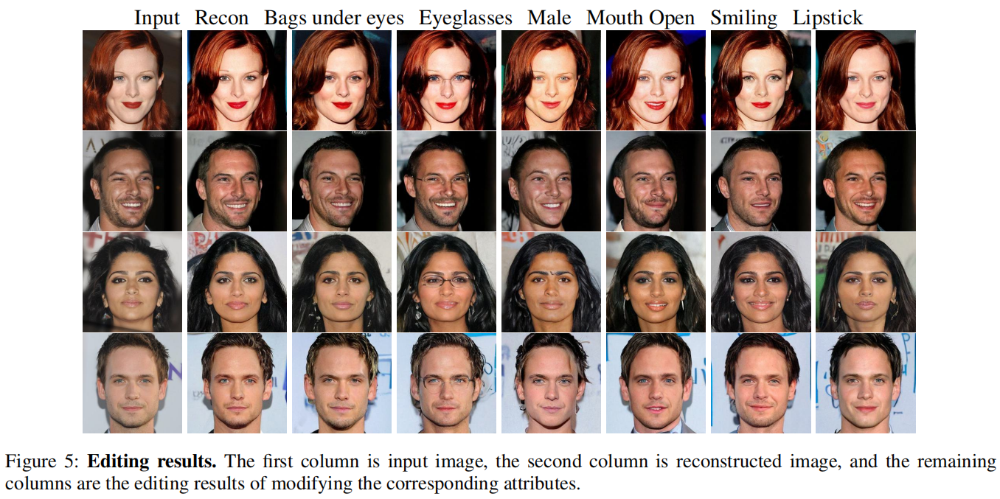

# CycleDiff: Facial Semantic Editing Based on Diffusion Model


Pytorch implementation of **CycleDiff: Facial Semantic Editing Based on Diffusion Model**


> Abstract: As a class of generative models, diffusion model has attracted tremendous attention in recent years. Diffusion
models are able to synthesize near photo-realistic images. While applied to image editing task, most of methods based
on diffusion model either explicitly introduce a mask for user input during diffusion inference or generate mask before editing and can not achieve attribute-level control. In this paper, we propose CycleDiff, a novel approach to facial semantic editing based on diffusion model. A multi-attribute classifier is used to ensure the consistency of the
target attribute, and the high-level semantic consistency of the non-target attribute between the edited image and the
input image is insured by introducing cycle consistency constraint into the inference process. CycleDiff manipulate facial image according to a given attribute label without
mask (explicitly or implicitly). Experiments on CelebA-HQ dataset achieve convincing results that shows CycleDiff can be made highly effective.


## Usage
### Installation
 1.Create the virtual environment:
```
$conda create --name CycleDiff python==3.7
$conda activate CycleDiff
$pip install -e .
```
 2.Create a checkpoints dictionary and download [the pretrained diffusion model](https://drive.google.com/file/d/1_n1uUfC9muDNYzWKgPsreKPSY-v7GmOS/view?usp=sharing) and [multi-attribute classifier](https://drive.google.com/file/d/1BwVpstO7y19bJw8OFpmTL-ewfRF1y-0D/view?usp=sharing) to this folder.

### Image manipulate
Before modify image, you should set image_index and attribute_index in **optimization/attribute_editor.py**.

image_index indicates the index of input image in [CelebA-HQ](https://mmlab.ie.cuhk.edu.hk/projects/CelebA.html) dataset.

attribute_index indicates the attribute need to be changes.

| attribute_index | attribute           |
| --------------: | :------------------ |
| 2               | Bags_Under_Eyes     |
| 9               | Eyeglasses          |
| 11              | Male                |
| 12              | Mouth_Slightly_Open |
| 15              | Smiling             |
| 18              | Wearing_Lipstick    |
| 19              | Young               |
| 20              | Reconstruction      |

And the output_path is setted in **optimization/arguments.py**

Run this command:
```
$python main.py
```

### Train
If you want to train the diffusion model and multi-attribute classifier in other dataset, follow this:

#### Train multi-attribute classifier
Set dataset_path and output_path in preprocess/encoder_train.py.
```
$python preprocess/encoder_train.py --world_size 1 --rank 0 --multiprocessing_distributed True
```

#### Train Diffusion model
Set dataset_path and output_path in scripts/image_train.py.
```
$mpiexec -n $NUM_GPUS python scripts/image_train.py
```

## Framework


## Results

### Reconstruction


### Editing


### Editing for corresponding attributes

