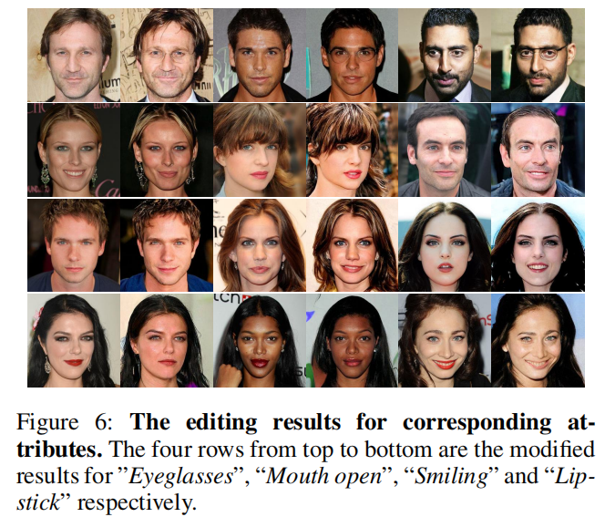

# CycleDiff: Facial Semantic Editing Based on Diffusion Model


Pytorch implementation of **CycleDiff: Facial Semantic Editing Based on Diffusion Model**


> Abstract: Diffusion model, as a class of generative model, has become increasing popular in recent years. By utilizing guidance from
classifier in inference process, diffusion model generates realistic images. while in image editing task based on diffusion
model, most of methods rely on text guidence or focus on object-level editing. In this paper, we make the first attempt at
adapting diffusion model to face attribute editing and propose
an effective diffusion inference method with cycle consistency (CycleDiff), which enables attribute editing with high
flexibility and fidelity. Specifically, we first introduce a multi-attribute classifier to ensure the consistency of the modified
image with target attributes. Then, to preserve high-level semantic consistency of faces in input image and edited result,
we combine cycle consistency with the diffusion inference process and investigate the step length of matching targets in
cycle consistency, and thereafter present two solutions, i.e.,
step-by-step and step-to-origin schema. Additionally, a theoretic analysis of these two schemes is given. Experimental results on CelebA-HQ validate the effectiveness of CycleDiff.


### Image manipulate
Before modify image, you should set image_index and attribute_index in **optimization/attribute_editor.py**.

image_index indicates the index of input image in [CelebA-HQ](https://mmlab.ie.cuhk.edu.hk/projects/CelebA.html) dataset.

attribute_index indicates the attribute need to be changes.

| attribute_index | attribute           |
| --------------: | :------------------ |
| 2               | Bags_Under_Eyes     |
| 9               | Eyeglasses          |
| 11              | Male                |
| 12              | Mouth_Slightly_Open |
| 15              | Smiling             |
| 18              | Wearing_Lipstick    |
| 19              | Young               |
| 20              | Reconstruction      |

And the output_path is setted in **optimization/arguments.py**

Run this command:
```
$python main.py
```

### Train
If you want to train the diffusion model and multi-attribute classifier in other dataset, follow this:

#### Train multi-attribute classifier
Set dataset_path and output_path in preprocess/encoder_train.py.
```
$python preprocess/encoder_train.py --world_size 1 --rank 0 --multiprocessing_distributed True
```

#### Train Diffusion model
Set dataset_path and output_path in scripts/image_train.py.
```
$mpiexec -n $NUM_GPUS python scripts/image_train.py
```

## Framework


## Results

### Reconstruction


### Editing


### Editing for corresponding attributes

